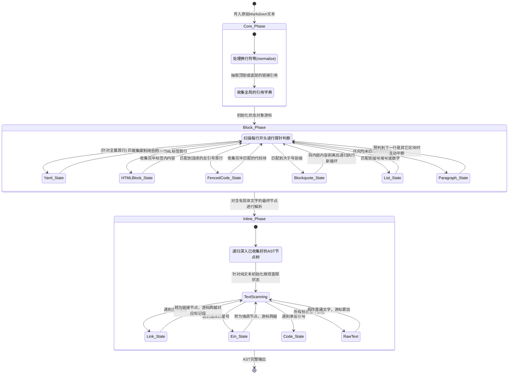
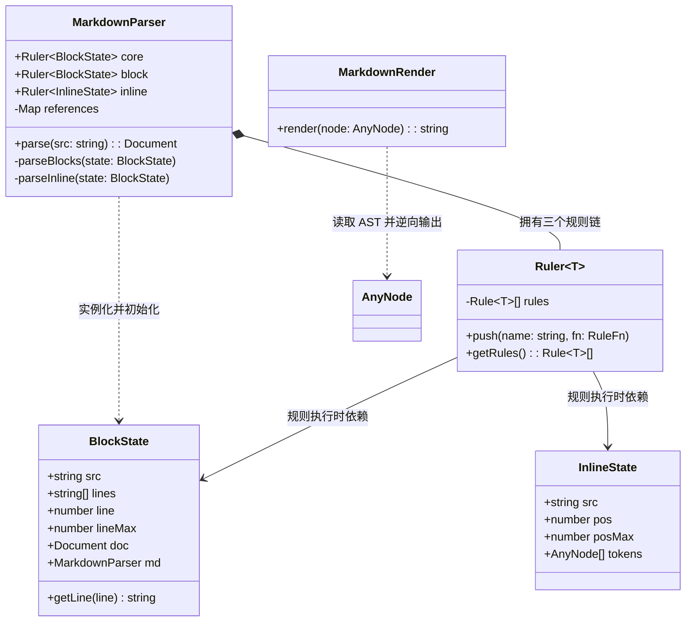
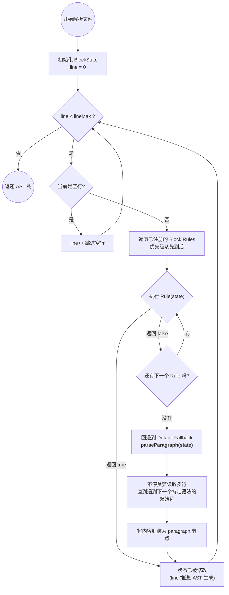

# TypeScript Markdown 解析器与状态机教学指南

本项目是一个基于 **TypeScript** 从零构建的严格符合 CommonMark 规范的 Markdown 解析器（Markdown Parser）。

该项目不仅是一个具备核心功能的解析器，更是一个**用于学习“状态机设计模式”与“编译原理（词法语法分析基础）”的优秀教学示例**。本指南将带你深入剖析如何使用状态机来管理复杂的字符串解析，以及在这个过程中如何优雅地实现可无限扩展的规则链。

---

## 1. 核心概念：什么是状态机？

在编译原理与文本解析中，“状态机（State Machine）”的概念极为核心。
想象一下你在阅读一本书的文字，你的眼睛（指针）在当前行停留，你的大脑中保存着当前的上下文（正在读一个列表？还是正在读引用？）。这个**游标位置 + 上下文数据**的集合，就是**状态 (State)**。

在这个 Markdown 解析器中，状态机体现在两个核心类中（位于 `src/state.ts`）：
- **`BlockState` (块级状态)**：负责逐行扫描 Markdown。它保存了当前解析到的行号 (`line`)，总行数 (`lineMax`)，以及正在构建的 AST 文档树 (`doc`)。
- **`InlineState` (行内状态)**：负责逐字扫描段落内容。它保存了当前解析到的字符索引 (`pos`)，总长度 (`posMax`)，以及行内生成的 Token 数组。

**状态如何转移？**
每次一个具体的**解析规则（Rule）**匹配成功，它就会修改状态对象（比如消耗掉了 3 行，就将 `line += 3`，然后将产出的 AST 节点塞入 `state.doc` 中）。规则处理完毕后退出，将修改后的“新状态”交还给总控循环，总控循环继续匹配下一个规则，这就完成了一次**状态转移**。

### 为什么不用单纯的正则表达式？

正则表达式的核心缺陷在于**缺乏“状态记忆”与处理深层递归（上下文无关文法）的能力**。
如果你尝试用纯正则匹配一个“包含引用块、且引用块里嵌套无序列表、且列表项里还有加粗文本”的结构，它几乎会崩溃（或者成为无人能维护的“天书”）。

相比之下，我们的状态机解析器：
1. **拥有记忆与上下文：** 在特定环境（如处在缩进代码块里），遇见 `*` 号只会当做纯文本，而不会触发加粗规则。
2. **具备主动跳出能力：** 我们在段落解析（`parseParagraph`）中拥有主动查探机制。如果段落扫描到下一行属于列表结构，状态机可以切断当前段落循环，立即转移控制权。
3. **无限次自我递归：** 在匹配出引用块内容后，只需抽取出纯文本，调用一个子级别的新状态机 `state.md.parse(innerSrc)`，轻松解构极度复杂的嵌套排版。

---

## 2. 目前 md-parser 有几种状态？它们如何被驱动？

宏观上讲，本解析器其实分为 **三个阶段的大状态**（Core、Block、Inline）。而微观上看，真正体现状态机特质的是在 **Block 解析期**的游标轮转。我们在代码里拥有的具体子状态包括（但不仅限）：

1. **Idle（行扫描状态）：** 等待判定下一行的身份。
2. **特定的 Block 状态：** 如 `HTMLBlock_State`、`FencedCode_State` 等，一旦进入，它们有各自的循环吸收自己需要的行。
3. **Paragraph（打底文本状态）：** 所有非特殊格式的避风港。
4. **Inline 子状态：** 剥掉外壳后，针对文字逐字寻找加粗、链接的微观状态。

下面用 Mermaid 状态图全面展出从文字传入开始，状态和规则之间是如何转换的：



---

## 3. 全局架构：面向对象与规则链

本项目通过 `MarkdownParser` 作为总控（Director），`Ruler` 作为规则管理器，将负责脏活累活的解析逻辑彻底解耦为一个个独立的规则函数。

下面是本作的**全局核心类图 (Class Diagram)**：



---

## 3. 局部核心：解析工作流转机制

在 `src/parser.ts` 中的 `parseBlocks` 和 `parseInline` 实现了状态机的核心驱动逻辑。
以“块级解析流”为例，由于段落（Paragraph）可以吃掉任何无法匹配为特殊结构的行，所以我们让各种特定的语法规则（如标题、引用块）优先抢占，抢不到的情况下，才交给段落。

下面是**块级规则解析逻辑流转图 (Flowchart)**：



### 深度剖析：和常规编程语言 AST 解析有什么异同？
在 C 语言或 JSON 等标准格式的解析中，编译器的处理常常是标准两步走：**词法分析（Lexer）切碎内容 -> 语法分析（Parser）重组 AST 节点**。常规语言往往对换行、空格敏感度低。

但 Markdown 是一门 **严重依赖“换行”和“前置缩进”** 的排版语言。
这就决定了传统的单轨 Lexer 难以应付。因此本项目采取了 **Top-Down（自顶向下）两段式贪婪降级匹配策略**：
1. 先用 **Block Rulers（块级规则）** 把文章砸成大块的结构（引用的墙、列表的砖、代码块的框架）。
2. 被塞进段落或标题等内部的残余文本，再交由 **Inline Rulers（行内规则）** 用小刻刀细细雕琢，查找里面的加粗、链接、斜体。

### 核心亮点：俄罗斯套娃式的内、外层状态交互
“由于带有代码块或引用块，我们是如何做到外部状态机进入内部的？”
准确地说，**代码块内部是纯代码（不需要执行 Inline 解析），真正体现出内部状态大展拳脚的是“引用块（Blockquote `> `）”和“复杂列表”。**

外层状态机和内层状态机的真正交互，其实就是一场 **完全递归解耦**：
1. **剥壳伪装：** 外层 BlockState 发现某行以 `> ` 开头，它便将本行的 `> ` 砍掉，仅仅保留内部剩下的纯文本（比如 `> - 列表` 会被剥离成 `- 列表`）。
2. **递归召唤（Inception）：** 外层大状态机会召唤出我们系统持有的那个**共享总控 Parser**的实例，让这个总控去针对被剥壳的内部文本，再完完整整、独立不受干扰地跑一遍全新一生的 `Block & Inline` 解析。
3. **收养归宗：** 内层的小解析器跑完，会返回一棵全新的 AST 子树。外层状态机接过这棵子树，直接作为 `children` 挂载到自己的 `blockquote` 节点下方。

这极尽优雅。外层不必懂内层为什么那么变态复杂，它只要把壳剥走投喂即可。

---

## 4. 开发实战坑点总结 (避坑指南)

在编写严谨的 AST 转换工具或编译器时，总会遇到许多意想不到的边界情况。这里列出本项目开发中踩过的精华坑点，供学习参考：

### 坑 1：PowerShell 的 UTF-8 本地化坑
在尝试运行 Demo 后想要把输出的 AST 日志写入文件排查时，如果你使用 Windows PowerShell 的 `>` 或者 `Out-File` 进行重定向，若日志中包含中文字符，输出的文本文件极有可能会变成乱码（哪怕你的 VSCode 显示的是 UTF-8）。
**正确姿势：** 需要强制临时更改控制台字符集为 UTF-8，再输出文件：
```powershell
# 避坑魔法命令：
[Console]::OutputEncoding = [System.Text.Encoding]::UTF8; npx tsx example/demo.ts | Out-File example/output.txt -Encoding utf8
```

### 坑 2：段落截断与“贪婪吞噬”陷阱 (Greedy Paragraph Bug)
在最开始实现 Fallback（即 `parseParagraph`）时，只让段落通过“空行”来截断自身。
这导致了一个致命问题：
```markdown
这是一个段落，下面紧跟一个引用
> 但我被前面贪婪的段落给吃了！
```
**解决方案：** 段落收集文本行时（`src/parser.ts: parseParagraph` 内部循环），必须进行 **`isBreaking`** 提前预测。必须侦测下一行是否存在 `> `、`* `、`# ` 或 `| `（表格分隔符），如果遇到了这些特定规则的起始符，段落必须立即中断跳出，将接力棒交还给外部循环。

### 坑 3：TypeScript 的 `noUncheckedIndexedAccess` 索引陷阱
为了追求类型安全，我们的 `tsconfig.json` 开启了极严的 `noUncheckedIndexedAccess: true` 和 `exactOptionalPropertyTypes: true`。
```typescript
// 错误写法：即便前面判断了 length > 0，TS 依然判定索引取值可能为 undefined
if (state.tokens.length > 0 && state.tokens[state.tokens.length - 1].type === 'text') {
  (state.tokens[state.tokens.length - 1] as Literal).value += char; // TS 报错！
}
```
**解决方案：** 必须使用提取引用的方式进行类型收窄。
```typescript
const lastToken = state.tokens[state.tokens.length - 1];
if (lastToken && lastToken.type === 'text') {
  (lastToken as Literal).value += char; // 安全通过
}
```

### 坑 4：复杂的列表上下文 (List Context)
当你认为“空行”意味着区块结束时，List 规则给你上了一课：
Markdown 中的列表内，允许包含由空行隔开的多个段落，甚至是嵌套的代码块和表格（通过缩进决定归属）。
如果在 `src/rules/block-extended.ts: list()` 逻辑中，没有严格按照 `当前行缩进量 >= 列表 Marker 初始化时占据字符的缩进量` 来匹配，并且忘了在跳出时检测“是否这行属于全新的未缩进的其他块级元素（如 `# Heading`）”，会导致**后续不相关的文档全被塞进列表体内**。这是最耗费精力的解析难点之一。这也是为什么我们的 `BlockState` 中保存了总控 Parser 实用于无限递归的基础：
`const innerAst = state.md.parse(itemStr)`。

---

> _“一门好的教学项目，不仅仅在于把功能跑通。更在于结构如何设计，陷阱在哪，为什么这么做。”_

---

## 5. 进阶：YAML Frontmatter 与 双向闭环转化 (AST <=> Markdown)

作为更完善的应用级处理库，我们在单纯的 `parse` 之外，更进一步实现了 **完美的数据闭环能力** 和元数据格式兼容。

### YAML Frontmatter 兼容解析
现代 Markdown 文档（如 Hexo, Next.js 文章配置）中，顶部常附带 YAML 元属性段。为了解析它：
- **Block Rule 抢占处理：** 我们增设了特定规则 `yamlFrontmatter` 并强制塞向 `Block Rulers` 最顶端，要求：**触发游标必处绝对首行**。一旦起手命中 `---`，状态机立刻掠走包裹内容并封装，同时拉开游标位防止这断头尾的 `-` 被解析成 Setext H1 或 hr 分割线！
- **AST 支持：** 底层类型通过全新的派生项 `Yaml` 来承接元数据（Front-matter Metadata），避免和普通的 Code Block 混淆。

### `MarkdownRender`：从抽象语法树还原回文本格式
除了基础解析的核心类 `MarkdownParser`，另外补充了一个呈现转换工具：**`MarkdownRender`**。
它是执行状态机制约和 AST 解析的逆操作（**Reverse Serialization**）。它可以接纳由 Parser 转化出来的高度结构化对象集合，通过一套逆推 `switch` 重构算法和排版推断策略，把节点再度编织成极致规范的文本文件：

1. **复杂对齐推算**：不仅局限于文字内容还原，它会严格对齐原始结构的“嵌套标记”。比如 `<ol>` 若其内存在独立嵌套的 `paragraph` 或缩进子任务块，它将严丝合缝计算每个嵌套层所需的空格数予以反向生成。
2. **微观信息无损**：不论是最简单的段落文字还原，还是带有 `title` 气泡的内联链接 `[text](url "title")` 抑或图片节点，都能完整闭环实现。

**极致简单的 API 设计：**
```typescript
import { MarkdownParser, MarkdownRender } from './src';

// 文本 -> AST -> 文本 完美闭环串联
const ast = new MarkdownParser().parse('# Hello \n\n');
const rawMarkdown = new MarkdownRender().render(ast);
```

---

## 6. 实战拓展：手把手教你添加自定义语法！

在掌握了核心流转体系后，扩展我们的 Markdown 解析器会变得异乎寻常的简单。
得益于状态机的插拔式规则链，**我们完全不需要修改大核心（`MarkdownParser`），只需要按着步骤补充我们想要的特定规则即可**。

这里，我们将以添加非标但在各大博客极常用的 **「文字高亮语法 `==高亮==`」** 为你演示这套状态机极优雅的扩展性工作流。

### 步骤一：在底层定义扩充 AST 类型
文字高亮属于典型的行内微观语法（在段落内部查找），我们需要在 `src/ast.ts` 定义它：

```typescript
// 1. 定义 Highlight 类型的接口 (包含子节点，和加粗 Strong 类似)
export interface Highlight extends Parent {
  type: 'highlight';
}

// 2. 将其列入大一统范畴 (挂载入 InlineContent 尾部)
export type InlineContent = Text | Emphasis /* ... 等 */ | Highlight;
```

### 步骤二：编写一个完全解耦的查探规则 
在行内规则专属区域（`src/rules/inline.ts`）写一个匹配逻辑。
我们要做的就是**取文本 -> 匹配边界串 `==` -> 剥离内部文字塞入 Token 的 children -> 推进游标跨过消耗的长度 -> 交还控制权**。

```typescript
import { InlineState } from '../state';

export function highlightText(state: InlineState): boolean {
  // state.pos 永远告诉你此时的光标卡在哪里，取身后的剩余文本
  const tail = state.src.slice(state.pos);
  
  // 匹配被双等号包裹的任意非空文本
  const match = tail.match(/^==(.+?)==/);
  if (!match) return false; // 探测失败，告诉状态机去试下别的方法
  
  // 命中！捕获内容并塞入新的定制 AST 节点中
  state.tokens.push({
    type: 'highlight',
    children: [{ type: 'text', value: match[1] || '' }] 
  });
  
  // 必须：消耗掉游标，以便整机从新位置扫描
  state.pos += match[0].length;
  
  return true; // 告诉状态机：我已成功拦截并处理！
}
```

### 步骤三：把它插入“安检通道”
一切准备就绪，只需要让老板知道它的存在即可。
回到调度总控端 `src/parser.ts`，在 `initRules` 阶段把它加进 `Inline Rulers` 中：

```typescript
import { highlightText } from './rules/inline'; // 引入你的新玩具

class MarkdownParser {
  private initRules() {
    // ...
    // Inline Rules (优先级很重要，把它放到越前头，匹配度越高能防截胡)
    this.inline.push('highlightText', highlightText);
    this.inline.push('hardBreak', hardBreak);
    // ...
```

### 步骤四：教 `MarkdownRender` 怎么把它吐回去（可选）
如果你希望不仅能 `Parse` 还能把它完美重新 `Render` 出去，去 `src/render.ts` 的 `renderNode` 方法里写两行应对它：

```typescript
// ... switch (node.type) {
case 'highlight': {
  // 按照 Markdown 语法或者输出为 HTML
  return `==${this.renderChildren(node as Parent, '')}==`; 
}
// ...
```

**就这么简单！不伤骨架，随用随插。** 
在这个健壮的状态机底座上，你要写一套支持 Latex 的 `$$ 公式 $$` 规则？或者支持任务清单 `- [x]` 的 Block 规则？照猫画虎，三步即可完成！
